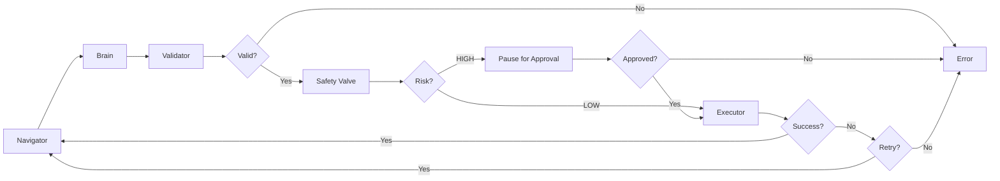

# FinAgent Sentinel 🤖💰

**Autonomous Financial AI Agent with Vision-Language Models & Voice Control**

A production-grade AI agent that uses Google Gemini Vision to navigate banking websites autonomously, with multilingual voice input, human-in-the-loop safety controls, and intelligent task completion.

[](https://opensource.org/licenses/MIT)
[](https://www.python.org/downloads/)
[](https://nodejs.org/)

---

## 🎯 Key Features

### 🧠 Vision-First Navigation
- Uses **Gemini 2.5 Pro Vision** to "see" and understand web UIs through screenshots
- No HTML parsing - pure visual understanding
- Adapts to dynamic UI changes automatically

### 🎤 Multilingual Voice Input
- **99+ language support** including Hindi (हिंदी), Tamil (தமிழ்), Telugu (తెలుగు), Bengali (বাংলা)
- Powered by **OpenAI Whisper** (offline processing)
- Preserves original language scripts (no translation)
- Real-time transcription with visual feedback

### 🔊 macOS Native TTS
- Instant audio feedback using macOS `say` command
- Announces task completion: "Task completed successfully"
- Offline, zero-latency playback
- No external dependencies

### 🛡️ Zero-Trust Safety
- **"Conscious Pause"** mechanism for high-risk financial actions
- Human approval required before executing transactions
- Screenshot review - see exactly what the agent sees
- Duplicate action prevention to avoid repeated transactions

### 🔄 Intelligent Task Completion
- Automatic detection of task completion
- Prevents infinite loops after successful actions
- Smart retry logic with exponential backoff
- Handles transient success messages gracefully

### 📊 Real-time Monitoring
- WebSocket-based dashboard with live agent logs
- Color-coded event stream
- Connection status indicators
- Session persistence across refreshes

### 🧮 Neuro-Symbolic Validation
- Deterministic financial calculations using Python `Decimal`
- Affordability checks before transactions
- Balance extraction and validation
- Percentage-based amount calculations

---

## 📁 Project Structure

```
finagent-sentinel/
├── backend/                    # Python FastAPI + Agent Logic
│   ├── app/
│   │   ├── main.py            # WebSocket Server & Session Management
│   │   ├── brain.py           # Gemini Vision Interface
│   │   ├── agent.py           # LangGraph State Machine
│   │   ├── voice.py           # Speech-to-Text (Whisper)
│   │   ├── tts.py             # Text-to-Speech (macOS say)
│   │   ├── validator.py       # Financial Logic Validator
│   │   ├── models.py          # Pydantic Schemas
│   │   ├── exceptions.py      # Custom Validation Errors
│   │   └── utils.py           # Helper Functions
│   ├── .env                   # API Keys & Configuration
│   └── requirements.txt       # Python Dependencies
├── frontend/                   # React + Vite Dashboard
│   ├── src/
│   │   ├── App.jsx            # Main Dashboard
│   │   ├── App.css            # Styles
│   │   └── components/
│   │       └── VoiceRecorder.jsx  # Voice Input Component
│   └── package.json
└── README.md
```

---

## 🚀 Quick Start

### Prerequisites

- **Python 3.9+** (3.10+ recommended)
- **Node.js 18+**
- **macOS** (for TTS features)
- **Google Cloud Project** with Vertex AI enabled

### 1. Clone the Repository

```bash
git clone https://github.com/Avinashdevray/sentinel-ai.git
cd sentinel-ai
git checkout agent-v-final
```

### 2. Setup Backend

```bash
# Navigate to backend
cd backend

# Create virtual environment
python3 -m venv venv
source venv/bin/activate  # On Windows: venv\Scripts\activate

# Install dependencies
pip3 install -r requirements.txt

# Install Playwright browsers
playwright install chromium

# Configure environment variables
cp .env.example .env
# Edit .env and add your credentials (see Configuration section)
```

### 3. Setup Frontend

```bash
# Navigate to frontend
cd frontend

# Install dependencies
npm install
```

### 4. Run the Application

**Terminal 1 - Backend:**
```bash
cd backend
python3 -m uvicorn app.main:app --reload --port 8000
```

**Terminal 2 - Frontend:**
```bash
cd frontend
npm run dev
```

**Open your browser:**
- Frontend Dashboard: http://localhost:3000
- Backend API: http://localhost:8000
- API Docs: http://localhost:8000/docs

---

## ⚙️ Configuration

### Environment Variables

Create `backend/.env` with the following:

```env
# Google Cloud Configuration
VERTEX_AI_PROJECT=your-project-id
VERTEX_AI_LOCATION=us-central1

# Optional: Browser Configuration
BROWSER_TYPE=chromium  # Options: chromium, firefox, webkit, chrome

# Optional: Session Configuration
SESSION_GRACE_PERIOD=300  # seconds (5 minutes)
```

### Google Cloud Setup

1. **Create a Google Cloud Project**
   - Go to https://console.cloud.google.com
   - Create a new project or select existing

2. **Enable Vertex AI API**
   - Navigate to APIs & Services
   - Enable "Vertex AI API"

3. **Setup Authentication**
   ```bash
   # Install gcloud CLI
   # https://cloud.google.com/sdk/docs/install
   
   # Authenticate
   gcloud auth application-default login
   
   # Set project
   gcloud config set project YOUR_PROJECT_ID
   ```

4. **Enable Billing**
   - Vertex AI requires billing to be enabled
   - Set up a billing account in Google Cloud Console

---

## 🎮 Usage

### Basic Task Execution

1. **Open the Dashboard** at http://localhost:3000
2. **Enter a task** (text or voice):
   ```
   Login and invest 500 rupees in gold
   ```
3. **Click "Start Task"** and watch the agent work
4. **Review the approval modal** when it pauses before high-risk actions
5. **Approve or Reject** the transaction

### Voice Input

1. **Click the microphone button** 🎤 next to the task input
2. **Speak your command** in any language:
   - English: "Login and invest five hundred rupees in gold"
   - Hindi: "लॉगिन करें और सोने में पांच सौ रुपये निवेश करें"
   - Tamil: "உள்நுழைந்து தங்கத்தில் ஐநூறு ரூபாய் முதலீடு செய்யவும்"
3. **Stop recording** - transcription appears in task field
4. **Click "Start Task"**

### Example Tasks

```
# Simple login
Login with username 'demo' and password 'password'

# Navigation task
Go to the dashboard and click on 'Invest in Gold'

# Complete flow (triggers approval)
Login as demo/password, navigate to gold investment, and invest 1000 rupees

# Percentage-based investment
Login and invest 25% of my balance in gold

# Multi-step task
Login, check the balance, then invest 500 rupees in gold
```

---

## 🧠 How It Works

### Architecture Overview

```
┌─────────────────┐
│  Voice Input    │ (Whisper STT)
└────────┬────────┘
         │
         ▼
┌─────────────────┐
│   Dashboard     │ (React + WebSocket)
└────────┬────────┘
         │
         ▼
┌─────────────────────────────────────────────┐
│         FastAPI WebSocket Server            │
│  ┌──────────────────────────────────────┐  │
│  │      LangGraph State Machine         │  │
│  │                                       │  │
│  │  Navigator → Brain → Validator       │  │
│  │      ↑          ↓         ↓          │  │
│  │      └─ Executor ← Safety Valve      │  │
│  └──────────────────────────────────────┘  │
└─────────────────────────────────────────────┘
         │
         ▼
┌─────────────────┐
│  Playwright     │ (Browser Automation)
└─────────────────┘
         │
         ▼
┌─────────────────┐
│  Banking Site   │
└─────────────────┘
```

### State Machine Flow



### Vision-Based Navigation

The agent uses Gemini Vision to analyze screenshots:

```python
# brain.py
action = analyze_screenshot(
    screenshot_base64=screenshot,
    task="Invest 500 in Gold",
    current_url="http://example.com/gold"
)
# Returns: 
# {
#   "action": "click",
#   "selector": "text=Buy Gold",
#   "risk_level": "HIGH",
#   "reasoning": "FINAL ACTION: Executing purchase"
# }
```

### Neuro-Symbolic Validation

Deterministic validation layer for financial operations:

```python
# validator.py
validator.validate_affordability(
    balance="₹10,000.50",
    amount=500
)
# Returns: (True, Decimal('10000.50'), Decimal('500'))
# Raises: InsufficientFundsError if amount > balance
```

### Task Completion Detection

Prevents duplicate high-risk actions:

```python
# agent.py - brain_node
if action.risk_level == RiskLevel.HIGH and prev_action.get("risk_level") == "HIGH":
    # Duplicate HIGH RISK action detected
    await speak_completion("Task completed successfully")
    action = AgentAction(action=ActionType.DONE)
```

---

## 🛡️ Safety Features

### Multi-Layer Safety System

1. **AI Risk Classification**
   - Automatically identifies high-risk actions
   - Keywords: "Buy", "Pay", "Transfer", "Withdraw"
   - Context-aware reasoning

2. **Neuro-Symbolic Validation**
   - Deterministic financial calculations
   - Balance extraction and verification
   - Affordability checks

3. **Human-in-the-Loop**
   - Screenshot review before execution
   - Explicit approve/reject buttons
   - Full action context displayed

4. **Duplicate Prevention**
   - Detects repeated high-risk actions
   - Auto-completes to prevent double transactions
   - Handles transient success messages

5. **Session Management**
   - Isolated browser contexts per task
   - Automatic cleanup on completion
   - Grace period for reconnections

---

## 🎨 Frontend Features

- **Modern Dark Theme** - Easy on the eyes
- **Split Screen Layout** - Control panel + live logs
- **Color-Coded Logs** - Visual feedback for events
- **Voice Recorder UI** - Microphone button with recording indicator
- **Approval Modal** - Full-screen review interface
- **Connection Status** - Real-time WebSocket indicator
- **Session Persistence** - Maintains state across refreshes

---

## 🐛 Troubleshooting

### Common Issues

**Issue**: "Vertex AI authentication failed"
```bash
# Solution: Authenticate with gcloud
gcloud auth application-default login
gcloud config set project YOUR_PROJECT_ID
```

**Issue**: "Whisper model not found"
```bash
# Solution: Model downloads automatically on first use (~500MB)
# Wait for download to complete, check backend logs
```

**Issue**: "Frontend can't connect to WebSocket"
```bash
# Solution: Ensure backend is running on port 8000
curl http://localhost:8000/health
```

**Issue**: "Playwright browser not launching"
```bash
# Solution: Install browsers
playwright install chromium
```

**Issue**: "Voice transcription not working"
```bash
# Solution: Check microphone permissions in browser
# Ensure backend/app/voice.py exists
# Check backend logs for Whisper loading
```

**Issue**: "TTS not speaking"
```bash
# Solution: TTS only works on macOS
# Test manually: say "Hello"
# Check system volume
```

---

## 📊 Dependencies

### Backend

| Package | Version | Purpose |
|---------|---------|---------|
| fastapi | 0.115.0 | WebSocket server |
| uvicorn | 0.32.0 | ASGI server |
| langchain | 0.3.7 | Agent framework |
| langchain-google-vertexai | 2.0.8 | Gemini integration |
| langgraph | 0.2.45 | State machine |
| playwright | 1.48.0 | Browser automation |
| openai-whisper | latest | Speech-to-text |
| pydantic | 2.9.2 | Data validation |

### Frontend

| Package | Version | Purpose |
|---------|---------|---------|
| react | 18.3.1 | UI framework |
| vite | 5.4.21 | Build tool |
| lucide-react | 0.562.0 | Icons |

---

## 🔮 Future Enhancements

- [ ] Multi-agent orchestration
- [ ] Session replay/recording
- [ ] Custom risk policies
- [ ] Natural language task parsing
- [ ] Screenshot annotation with bounding boxes
- [ ] Support for more languages in TTS
- [ ] Mobile app interface
- [ ] Integration with real banking APIs
- [ ] Advanced analytics dashboard
- [ ] Automated testing suite

---

## 📝 API Documentation

### WebSocket Events

**Client → Server:**
```json
{
  "type": "start_task",
  "task": "Login and invest 500 in gold",
  "start_url": "http://localhost:8501"
}
```

**Server → Client:**
```json
{
  "type": "log",
  "message": "🧠 Analyzing screenshot with Gemini Vision..."
}
```

**Approval Request:**
```json
{
  "type": "approval_request",
  "action": {
    "action": "click",
    "selector": "text=Buy Gold",
    "risk_level": "HIGH"
  },
  "screenshot": "data:image/png;base64,..."
}
```

### REST Endpoints

**Voice Transcription:**
```bash
POST /api/voice/transcribe
Content-Type: multipart/form-data

# Response:
{
  "text": "लॉगिन करें",
  "language": "hi",
  "segments": [...]
}
```

---

## 🧪 Testing

### Manual Testing Checklist

- [ ] Voice input in English
- [ ] Voice input in Hindi/Tamil/other languages
- [ ] Task execution with approval
- [ ] Task rejection
- [ ] Session reconnection
- [ ] Duplicate action prevention
- [ ] TTS completion announcement
- [ ] Balance validation
- [ ] Percentage-based amounts

### Running Tests

```bash
# Backend tests (if implemented)
cd backend
pytest

# Frontend tests (if implemented)
cd frontend
npm test
```

---

## 📄 License

MIT License - See [LICENSE](LICENSE) file for details

---

## 🙏 Acknowledgments

- **Google Gemini** for Vision AI capabilities
- **LangChain/LangGraph** for agent framework
- **OpenAI Whisper** for multilingual speech recognition
- **Playwright** for reliable browser automation
- **FastAPI** for modern WebSocket server

---

## 👥 Contributing

Contributions are welcome! Please feel free to submit a Pull Request.

1. Fork the repository
2. Create your feature branch (`git checkout -b feature/AmazingFeature`)
3. Commit your changes (`git commit -m 'Add some AmazingFeature'`)
4. Push to the branch (`git push origin feature/AmazingFeature`)
5. Open a Pull Request

---

## 📧 Contact

**Avinash Devray**
- GitHub: [@Avinashdevray](https://github.com/Avinashdevray)
- Repository: [sentinel-ai](https://github.com/Avinashdevray/sentinel-ai)

---

## 🏆 Built For

**FinAgent Sentinel Hackathon** - Demonstrating the future of autonomous financial agents with vision AI and human oversight.

---

**⭐ If you find this project useful, please consider giving it a star!**
